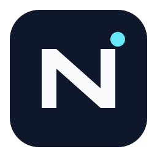

<div align="center">
  
  <h1> NexusOS</h1>
  <p><strong>專為學者打造的終極 AI 原生個人科研與學習作業系統</strong></p>

  <p>
    <a href="https://github.com/Tomoyo-Kusosawa/Nexus/releases"></a>
    <a href="https://github.com/vuejs/core"></a>
    <a href="https://www.typescriptlang.org/"></a>
    <a href="https://www.nexusos.top"></a>
    <a href="https://opensource.org/licenses/MIT"></a>
  </p>

  <p>
    <a href="./README.md">English</a> | <a href="./README_zh-CN.md">简体中文</a> | <b>繁體中文</b>
  </p>
</div>

---

## 📖 專案簡介

**NexusOS** 是一款專為學者、碩博士研究生、科研人員及演算法工程師打造的**在地優先、AI 原生的一體化學術科研學習作業系統**。它打破了傳統科研過程中工具割裂的壁壘，將文獻流轉、智能研讀、LaTeX 論文工坊、實驗資產管理、拓撲圖譜以及組會週報統整為一個高度安全、極度順暢的單一應用。

---

## ✨ 核心特性深度解析

### 🤖 1. 全局 AI 智慧管家與工作台中樞
* **雙管線執行引擎：**
  * **標準執行管線：** 能夠將自然語言指令精準解析為底層系統動作（JSON Actions），一鍵批次調度文獻狀態、日程及任務。
  * **Super 學術創作管線：** 融合深度長文推理、沙盒程式碼運行與論文直接寫入功能。
* **多維 RAG 檢索與風格克隆：** 支援掛載多篇文獻，既可切片提取事實知識，亦可 1:1 克隆高水準標竿文獻的學術句式、行文邏輯與段落厚度。
* **動態技能外掛市場：** 支援一鍵從 GitHub 倉庫拉取專業學術技能包，無縫拓展專屬科研工作流程。
* **AI 算力監控台：** 即時監聽全局 Token 吞吐消耗，監控 Ollama、OpenAI、DeepSeek 等各大節點的連通健康度。

### 📚 2. 文獻流轉管線 (Kanban Pipeline)
* **全流程看板管理：** 在「待讀」、「略讀」、「精讀」與「復現中」四大佇列間自由拖曳，精準把控閱讀進度。
* **智慧解析與智慧防重：** 拖曳 PDF 秒級解析標題、作者、DOI、期刊及年份，自動檢測庫內重複文獻，避免重複閱讀。
* **內建鏡像源文獻擷取：** 支援配置 SciDown 等鏡像路由，輸入 DOI 即可透過內嵌環境高速擷取文獻。
* **歸檔冷庫與 BibTeX 匯出：** 拖曳至底部即可將已讀文獻送入歸檔庫，支援一鍵複製標準學術 BibTeX 引用代碼。

### 📖 3. 全能沉浸式 AI PDF 閱讀器
* **雙欄全文對照翻譯：** 支援 PDF 原文與 AI 翻譯後的高品質 Markdown 版面配置雙欄並列呈現，帶有平滑同步捲動機制。
* **多維深度批註：** 劃詞螢光筆/底線、自由拖曳的多色便利貼，並支援按 `想法`、`疑問`、`重點`、`待辦` 分類標記。
* **伴讀 AI Copilot：** 針對當前文獻即時提問、一鍵生成含核心論點/方法論的結構化總結，並由 AI 推薦高相關度延伸文獻。
* **長筆記創作室：** 內建完整 Markdown 筆記系統，自動關聯至全局資源圖譜，支援一鍵匯出為 `.md` 或排版 `.pdf`。

### ✍️ 4. 論文工坊 (Paper Studio)
* **混合編輯革命：** 採用 Tiptap + KaTeX 架構，兼具視覺化排版的順暢與原生 LaTeX 程式碼區塊的嚴謹，繁雜公式按兩下即改。
* **頂尖期刊範本生態：** 原生整合 **IEEE Transactions**（單/雙欄）、**ACM Conferences** (`acmart`)、**Nature/Springer**、**Elsevier** (`elsarticle`)，支援直接上傳官方 `.zip` 範本包。
* **Overleaf 級在地極速編譯：** 無縫對接在地 TeXLive 環境（支援 `xelatex`、`pdflatex`），具備輸入防抖自動編譯、即時 PDF 渲染與精準日誌報錯定位。
* **智慧交叉引用系統：** 自動索引全文插圖 (`\ref{fig:...}`)、公式 (`\ref{eq:...}`) 與文獻 (`\cite{...}`)。
* **AI 論文審稿專員：** 自動生成三線表（Booktabs）、深度潤飾學術語氣、精簡降重，甚至生成萬字盲審評估意見報告。

### 🕸️ 5. 學術資產、實驗管理與資源圖譜
* **動態資源圖譜 (Resource Graph)：** 自動將文獻、工業資料集、個人筆記、程式碼環境編織成互動式拓撲網絡，支援微觀關係漫遊。
* **工業資料集與瀏覽器書籤掃描：** 統一管理在地磁碟映射與線上資料來源，一鍵掃描 Chrome、Edge 等瀏覽器我的最愛提取科研資料集。
* **程式碼環境與 IDE 連動：** 記錄 Conda 環境與執行指令，一鍵調用系統底層喚醒 VS Code 對應工作區。
* **智慧組會週報引擎：** 自動遍歷您一週內的真實科研行為軌跡（完成任務、精讀文獻、工坊修改），一鍵生成詳盡週報並支援 AI 潤飾。

### 🧩 6. 自訂動態工作區
* **模組化自由排版：** 任意組裝無盡縱向日曆、番茄專注鐘、科研貢獻熱力圖、截稿雷達等內建模組。
* **沙盒自訂掛件開發：** 支援撰寫 HTML/JS/CSS 程式碼並在獨立沙盒中運行，透過 `PHM.api` 自由讀取系統底層數據。

---

## 🛠️ 技術架構

* **前端框架：** Vue 3 (Composition API), TypeScript, Vite
* **編輯器核心：** Tiptap, ProseMirror, KaTeX
* **PDF 解析引擎：** PDF.js
* **樣式與圖示：** TailwindCSS, Lucide Icons
* **資料儲存：** 在地 SQLite 資料庫（在地優先，絕不上傳隱私數據）

---

## 🚀 快速上手

### 環境準備
- Node.js (`>= 18.x`)
- Git
- 在地 TeXLive / MacTeX 環境（選填，若需在地編譯 LaTeX 生成 PDF）

### 在地部署運行

```bash
# 1. 複製程式碼倉庫
git clone https://github.com/Tomoyo-Kusosawa/Nexus.git

# 2. 進入專案目錄
cd Nexus

# 3. 安裝相依套件
npm install

# 4. 啟動在地開發服務
npm run dev
```

## 🔗 官方網站與技術支援

* 🌐 **官方網站：** [www.nexusos.top](https://www.nexusos.top)
* ✉️ **技術支援與建議回饋：** [support@nexusos.top](mailto:support@nexusos.top)
* 🐛 **問題回饋與交流：** [GitHub Issues](https://github.com/Tomoyo-Kusosawa/Nexus/issues)

## 📄 開源協議

本專案採用 [MIT License](LICENSE) 協議開源。
